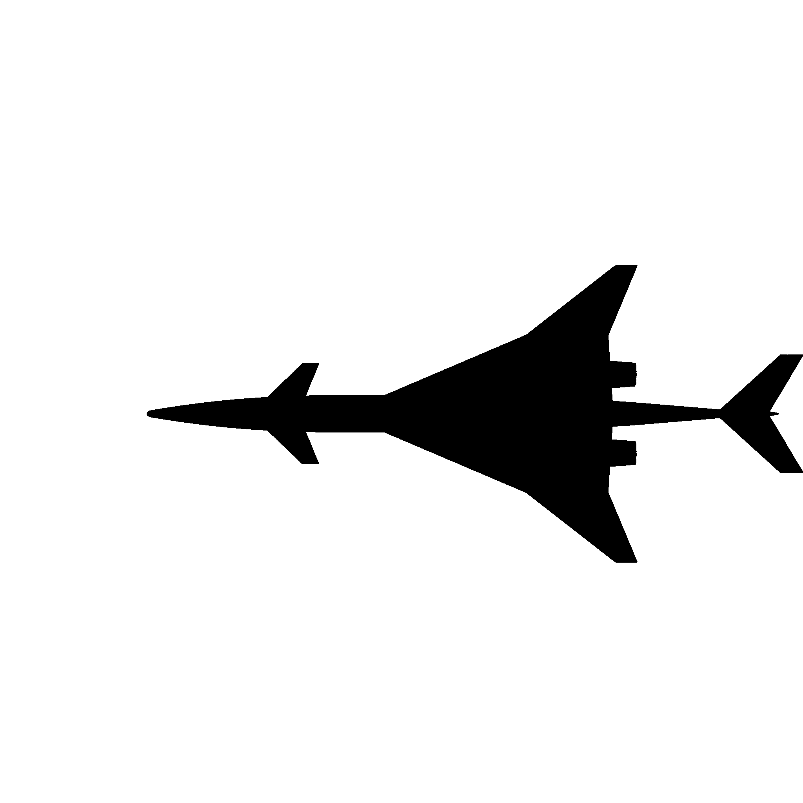

# </img> SCALOS

This is a class project for CSE 583 at UW but will eventually be puslished for public use. 
The goal of the project is to take the standard corrected Kirsten Wind Tunnel data for post process and data visualizatoin. 
The project are by Kuang-Ying"Eddie" Ting, Xiaohai"Bob" Hu, and Yiju Hu. 

## Project Background 
Supersonic airliners/SSBJs are optimized at cruise speed and often neglect low-speed impact at takeoff,  approach, and landing. The goal of the SCALOS proejct is to study on how the shapes and configurations affect the aircraft’s aerodynamics, handling qualities, dynamic, stability and control. 

This project aims to analyze the experimental wind tunnel data for design space and trade-off study of supersonic airliner/ business jet at low speeds. The goal of the class project is to extract the commercial wind tunnel standard corrected data for look-up, search, process, and visualization. 


## Project Structure 
The data structure of this project 

    .
    ├── README.md
    └── project
        ├── CSE583 Project Proposal.pptx
        ├── data
        │   ├── finaldata_uw2298.csv
        │   ├── finaldata_uw2320.csv
        │   ├── finaldata_uw2326.csv
        │   └── finaldata_uw2331.csv
        ├── doc
        │   └── Design.md
        ├── ref
        │   ├── 6.2022-1800.pdf
        │   └── 6.2022-1803.pdf
        ├── runlogs
        │   ├── Autosort Run Log 2298.xlsx
        │   ├── Autosort Run Log 2320.xlsx
        │   ├── Autosort Run Log 2326.xlsx
        │   └── Autosort Run Log 2331.xlsx
        ├── sandbox
        │   └── Extract_data.ipynb
        ├── src
        │   └── __init__.py
        └── tests
            └── __init__.py

## Installation
[1] Install the latest version of Anaconda for your system from [here](https://docs.anaconda.com/anaconda/install/). Please make sure to **install the Python 3.9 version**. The dependencies should also work for other Python versions. Project aim to support Linux and MacOS, so make sure you have access to a machine with either of these operating systems.

[2] Execute the following steps to setup the repository and install the required dependencies.
```
conda create -n scalos python=3.9
git clone https://github.com/eddiekyting/SCALOS.git
cd SCALOS
conda env update -n scalos -f environment.yml
conda activate scalos
```
[3] Now head over to SCALOS directory


## Run log and Data 
There are several entries for the KWT. Each entries contains a run log and a data set. Run log contains detailed information on the run corresponding to the data file which contains data points. The detailed inforamtion on the run log and data are described in subsection. 

    Year   Month  Entry    Run   Data Collection 
    2020   Jul    uw2292   152   Force, moment, and flow visualziation 
    2020   Aug    uw2295    23   Force and moment
    2020   Sep    uw2298   133   Force and moment
    2021   Jun    uw2320   148   Force and moment
    2021   Aug    uw2324    54   Flow visualziation 
    2021   Sep    uw2326   255   Force and moment
    2021   Nov    uw2331   150   Force, moment, and flow visualziation

### Run log 
    Each 
    1.  RUN NO:         Run number for specific entry 
    2.  WT.\nTARE\nRUN: Wind off for weight tare
    3.  CONFIGURATION:  Tested model configuration specification 
                        (wing, fuselage, nacelle, vertical tail, horizontal tail, canard)                  
    5.  TYPE OF RUN:    Pitch run (P) or yaw run (Y)
    4.  a:              Pich angle (deg) = angle of attack 
    5.  Y:              Yaw angle (deg)
    6.  qnom (psi):     Nominal dynamic pressure 
    7.  FLAP L/R:       Wing flap deflection of left/right
    8.  AIL L/R:        Wing aileron deflection of left/right
    9.  STAB:           All moving horizontal tail deflection
    10. RUD:            Veritcal tail deflection 
    11. CAN:            Canard deflection 
    12. LE IB/OB:       Leading edge deflection of inboard/outboard
    13. TRIP DEF:       Turbulence trip dot definition 
    14. DATE:           Test date
### Data 
 
    1.  RUN:            Run number for given entry 
    2.  TEST:           Entry number
    3.  TP:             Test points collected                   
    4.  ALPHAC (deg):   Pich angle (deg) = angle of attack 
    5.  BETA (deg):     Sideslip angle (deg) = - Yaw angle (PSI)
    6.  PSI (deg):      Yaw angle (deg) = - Sideslip angle (BETA)
    7.  QC (psi):       Corrected dynamic pressure 
    8.  RE_MAC:         Reynold numbers (RE) with repect to test letter mean aerodynamic chord (MAC)
    9.  TEMPTS (F):     Tempearture during tests
    10. CL:             Nondimensional lift coeffeicetint, CL = L/(1/2 rho v^2 S), with respect to test letter specification 
    11. CD:             Nondimensional drag coeffeicetint, CD = D/(1/2 rho v^2 S), with respect to test letter specification 
    12. CY:             Nondimensional side force coeffeicetint, CY = Y/(1/2 rho v^2 S), with respect to test letter specification  
    13. CM:             Nondimensional pitch moment coeffeicetint, CM = M/(1/2 rho v^2 S c), with respect to test letter specification 
    14. CR:             Nondimensional roll moment coeffeicetint, CR = R/(1/2 rho v^2 S b), with respect to test letter specification 
    15. CN:             Nondimensional yaw moment coeffeicetint, CN = N/(1/2 rho v^2 S b), with respect to test letter specification 
    16. WA:             Wind axis, number after axis specified the center of gravity location on percentage of the mean aerodynamic chord
    17. SA:             Stability axis, number after axis specified the center of gravity location on percentage of the mean aerodynamic chord
    18. BA:             Body axis, number after axis specified the center of gravity location on percentage of the mean aerodynamic chord
    19. LOD:            Lift over drag, Nondimensional lift coeffeicetint divided by nondimensional drag coeffeicetint. 


## Acknowledgement 
Support by NASA, Award/Contract \#80NSSC19K1661, under the Commercial Supersonic Technology (CST) program, Supersonic Configurations at Low Speeds, with Sarah Langston as the NASA technical grant monitor is gratefully acknowledged. The authors would like to thank Peter Coen, Lori Ozoroski, Sriram Rallabhandi, Melissa Carter, and Sarah Langston from NASA for the opportunity to conduct this needed research for supersonic aircraft. The authors would also like to thank the staff and crew of the University of Washington’s Kirsten Wind Tunnel (KWT), the 2020-2022 UW senior capstone design project teams, Anwar Moustafa and Colton Hill from class 2021, and Josh Ignacio from class 2022 for their assistance and contributions.
